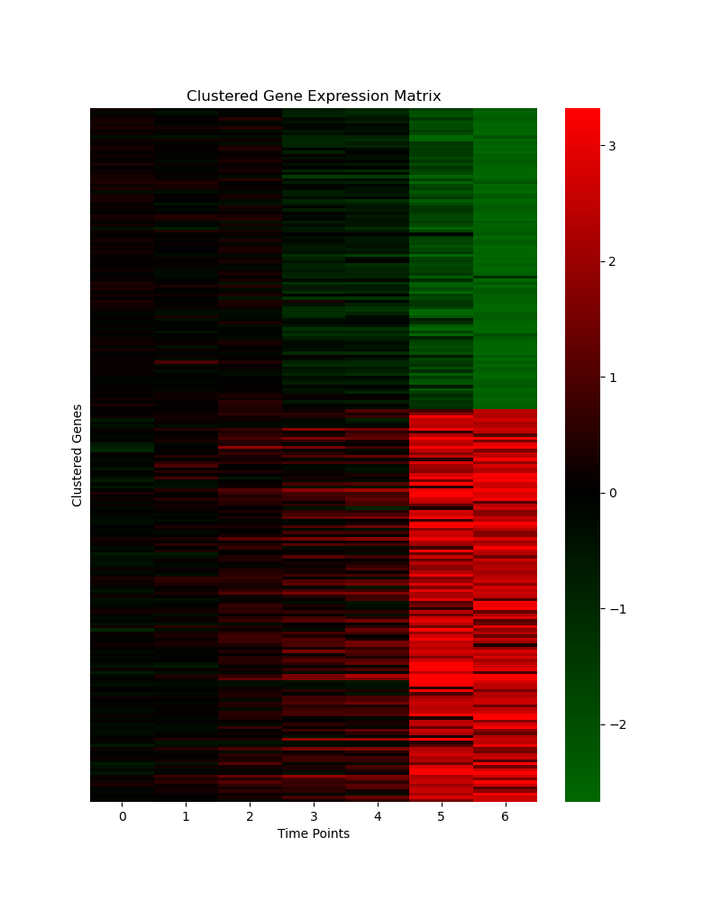
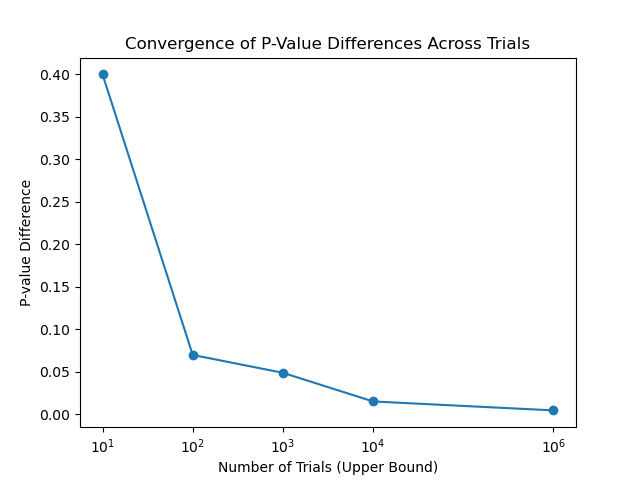

# Yeast Diauxic Shift Gene Expression Analysis

A computational analysis of gene expression changes during the yeast *Saccharomyces cerevisiae* diauxic shift, implementing custom variability metrics, K-means clustering, and statistical simulations for Gene Ontology enrichment analysis.

## Overview

This project analyzes the DeRisi dataset to identify genes with significant expression changes during the diauxic shift: the metabolic transition from glucose fermentation to ethanol respiration. The analysis includes:

- Development and comparison of custom gene variability metrics
- K-means clustering to reveal temporal expression patterns
- Simulation-based p-value calculations for GO enrichment analysis

For detailed methodology, theoretical background, and comprehensive analysis, see the [full report](report.pdf).

## Requirements

- Python 3.12
- numpy
- pandas
- scikit-learn
- scipy
- matplotlib
- seaborn

## Installation

Create and activate the conda environment:
```bash
conda env create -f environment.yml
conda activate yeast-analysis
```

## Usage

Run the complete analysis pipeline:
```bash
python main.py
```

The pipeline performs the following steps:

1. **Data Loading and Preprocessing**: Loads gene expression data, applies log2 transformation (if needed), and handles duplicate ORF identifiers
2. **Variability Analysis**: Compares four metrics for identifying the most variable genes
3. **Clustering Analysis**: Performs K-means clustering with automatic cluster number selection using silhouette scores
4. **Visualization**: Generates clustered and unclustered heatmaps
5. **Statistical Simulations**: Demonstrates p-value calculations through empirical, binomial, and hypergeometric approaches

## Key Results

### Gene Selection Metrics

Four variability metrics were evaluated against the authors' selection using Jaccard coefficient:

- Proposed Metric II: 0.714 (best performance)
- Standard Deviation: 0.640
- Range: 0.623
- Proposed Metric I: 0.515

### Clustering Results

**Authors' 228 genes**: 2 optimal clusters (silhouette score: 0.754)
- Cluster 1: Down-regulated genes (active during glucose consumption)
- Cluster 2: Up-regulated genes (active during ethanol consumption)

**Full genome**: 3 optimal clusters (silhouette score: 0.316)
- Clusters 1 and 2: Similar to authors' patterns
- Cluster 3: Complex alternating pattern unrelated to diauxic shift

### Gene Ontology Enrichment

Analysis of 228 selected genes identified significant enrichment in:
- Tricarboxylic acid cycle: 13 genes (FDR: 1.72E-09)
- Aerobic respiration: 18 genes (FDR: 2.44E-05)

These pathways are critical for ethanol metabolism following glucose depletion.

## Implementation Details

- K-means clustering: random_state=13, n_init=10
- Clustering auto-stop threshold: 0.005
- P-value simulations: 1,000,000 trials for convergence
- Runtime: ~40 seconds (Apple M4 Pro)

## Output Files

All output files are generated in the `outputs/` directory:

- Heatmap visualizations (PNG format)
- List of 228 most variable genes for GO analysis (TXT format)
- P-value convergence plot (PNG format)

## Sample Visualizations

### Clustered Gene Expression Patterns



K-means clustering reveals two distinct expression patterns in the authors' curated gene set: down-regulated genes active during glucose consumption (Cluster 1) and up-regulated genes activated for ethanol consumption (Cluster 2).

### P-value Convergence Analysis



Empirical p-value stabilization across increasing trial counts, demonstrating that 1,000,000 trials provide sufficient precision for statistical analysis.

## References

Data provided by Dr. Borislav Hristov, based on the original DeRisi study of yeast diauxic shift gene expression.